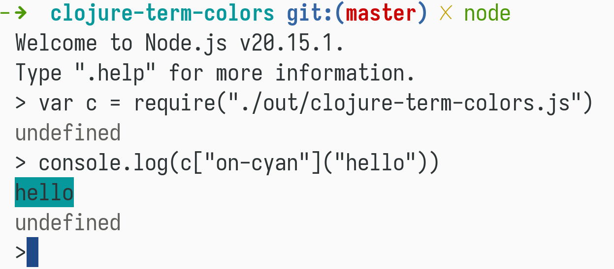

# clojure-term-colors

This is a fork of original [trhura/clojure-term-colors](https://github.com/trhura/clojure-term-colors), now made work with Clojurescript running on nodejs. 
The missing `:italic` is also added.

A Clojure library for ASCII terminal color output, based on python
termcolor package


## deps.edn

```clojure
net.coruscation/clojure-term-colors {:mvn/version "1.3.2"}
```

## Usage


_You can also set the `*disable-colors*` flag variable (using binding) if you want
to disable colors temporarily._

## Available Functions

```
white, cyan, magenta, blue, yellow, green, red, grey, on-white,
on-cyan, on-magenta, on-blue, on-yellow, on-green, on-red, on-grey,
concealed, reverse-color, blink, underline, dark, italic ,bold
```

## Bonus Point

You can even call it from javascript if for some reason you want to do it.



## License

Copyright © 2014 Thura Hlaing

Distributed under the Eclipse Public License either version 1.0 or (at
your option) any later version.
